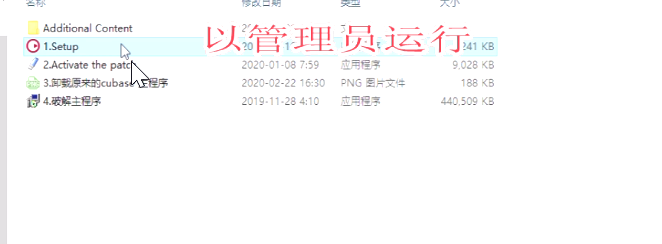
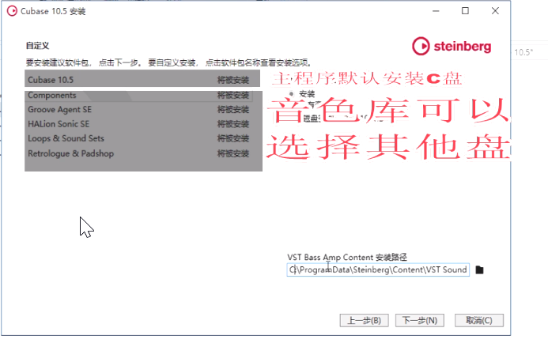
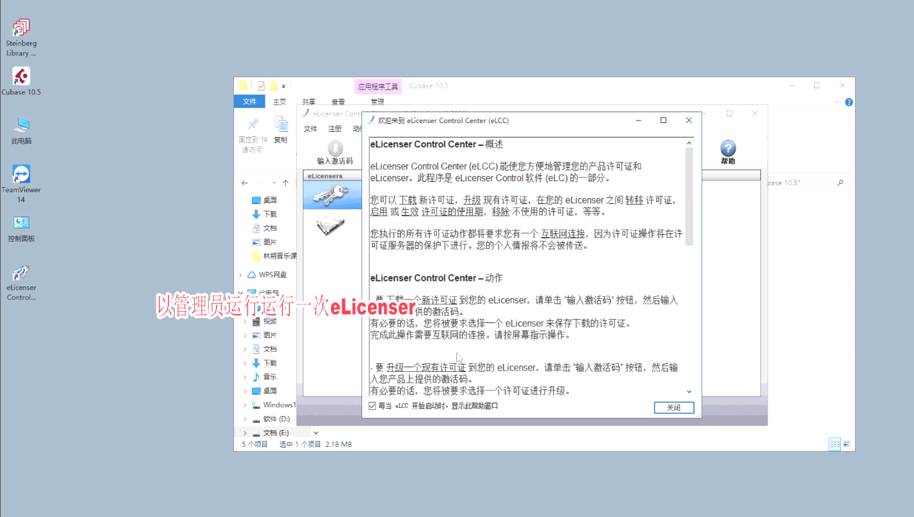
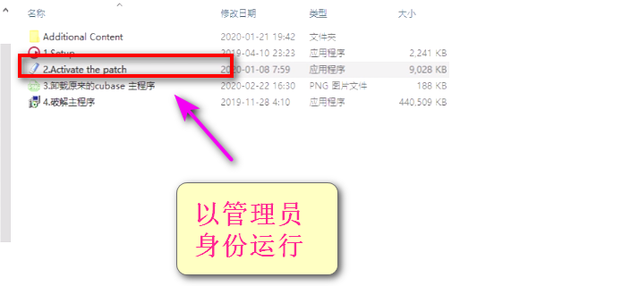
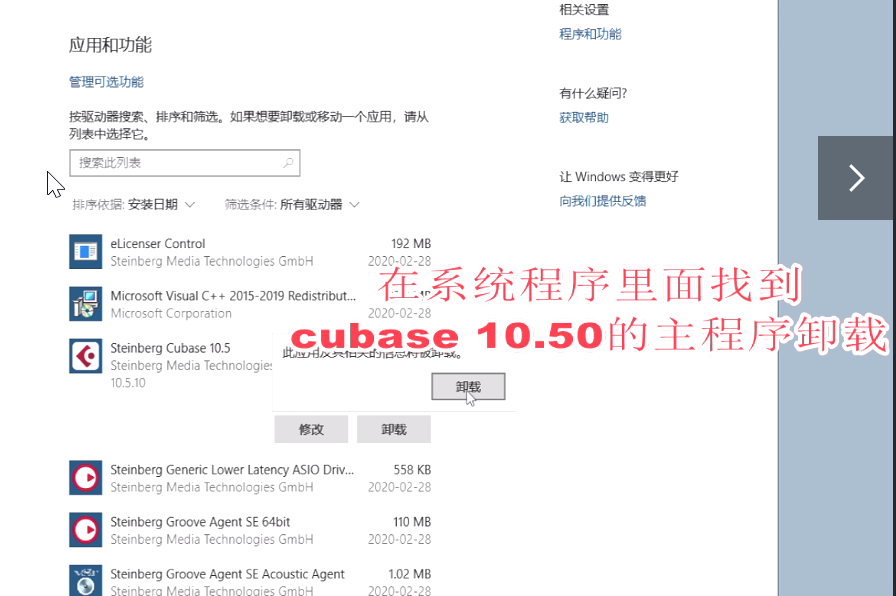
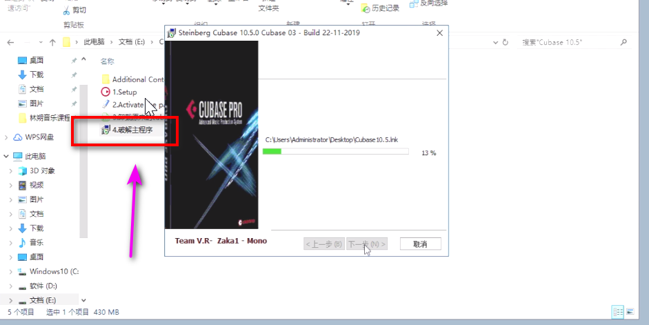
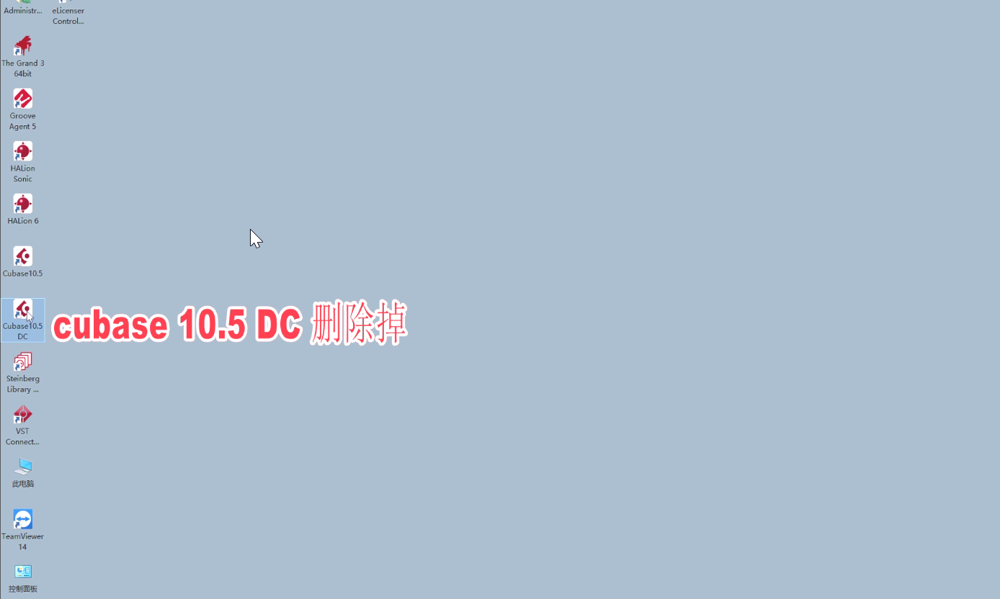
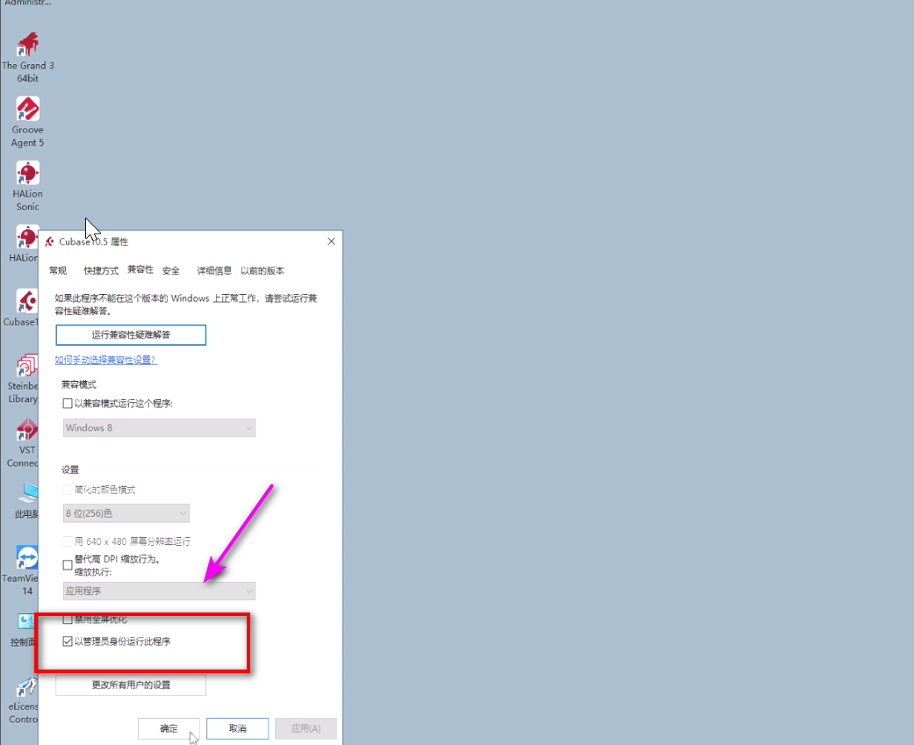
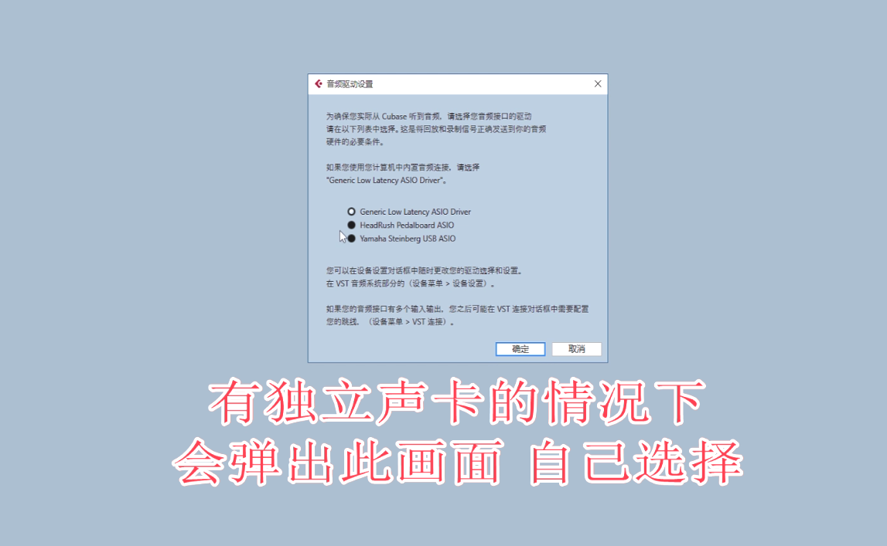
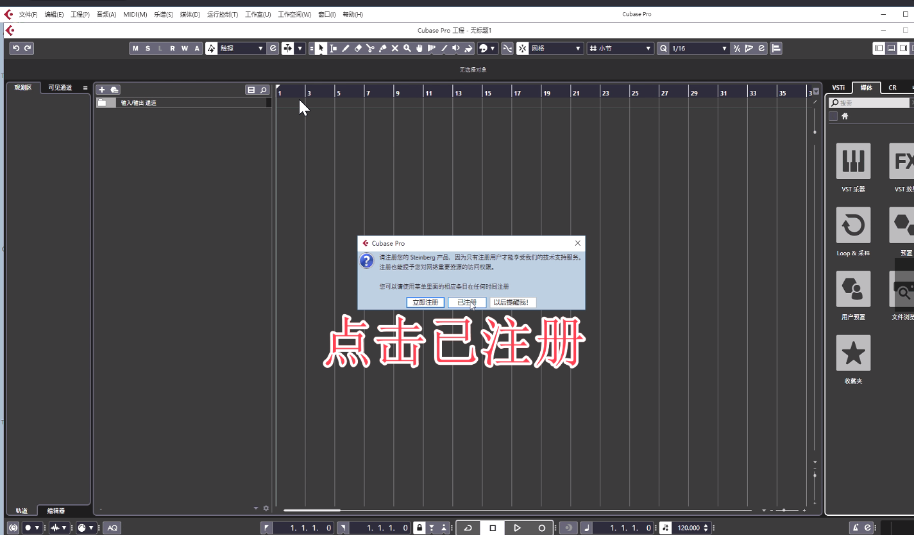

# Cubase安装教程

# 第1步 解压

文件密码

```
zhiyin
```

## 1.1 以管理员身份运行软件




## 1.2 更改磁盘符



## 1.3 以管理员身份运行






## 1.4 卸装主程序

卸装后把桌面上的图标也删除



# 2 破解程序

## 2.1 运行破解主程序



## 2.2  cubase0.5 DC删除






## 2.3 自行选择配置



## 2.4 点击注册

